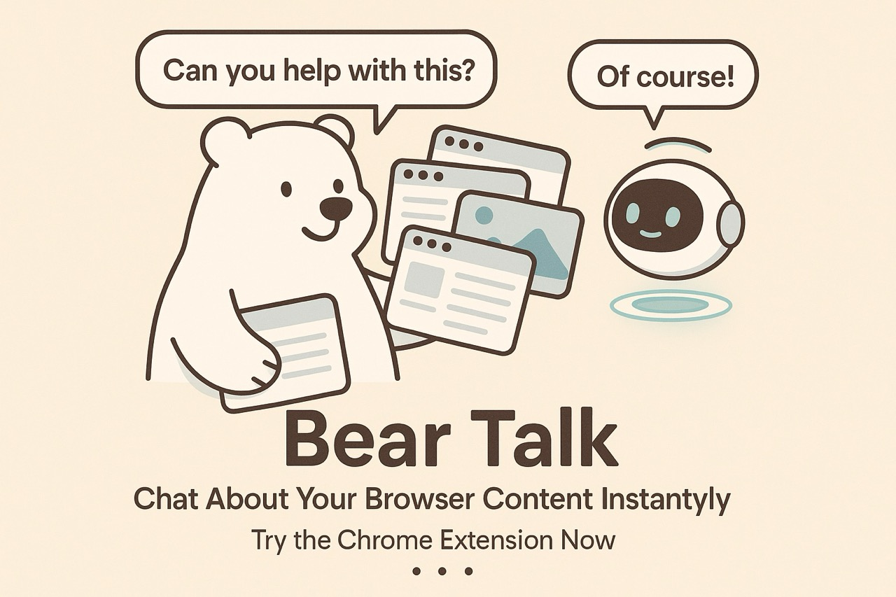

# 🐻‍❄️💬 Bear Talk

A one‑trick, very helpful bear: use selected browser tabs as context for your AI chats. No more re‑typing long explanations—your AI already knows what you’re talking about.

**Works with your existing AI chatbox—ChatGPT, Google Gemini, Claude, Perplexity. No extra subscription or API key required.**

### What it does

- Select a few tabs → Bear Talk collects clean summaries/snippets from them
- Works great with articles, docs, Notion pages, and YouTube videos
- Use with your favorite AI chat: ChatGPT, Google Gemini, Claude, Perplexity

### Quick start

1. Install:
   - From Chrome Web Store: [Bear Talk](https://chromewebstore.google.com/detail/bear-talk/amlejhgpkfmjpmfgdcflcopmkkkajjdb)
   - Or locally: Chrome → More Tools → Extensions → enable Developer mode → Load unpacked → choose the `bear-talk` folder
2. Pin the Bear Talk icon to your toolbar
3. Open the tabs you want as context → click the bear → pick tabs →
   - Copy the generated context and paste it into your AI chat, or
   - Use the provided button to open your AI chat with context ready (when available)

### Permissions

- Tabs and activeTab: list and read only the tabs you select
- Storage: save your options and prompts

### Privacy

- Content is processed locally. Nothing is sent anywhere until you paste/send it to the AI chat yourself.

Type less. Explain less. Get smarter replies. 🐻‍❄️✨
